# Introduction

Contributors to this repo are [Zachary Christoff](https://www.linkedin.com/in/zach-christoff-485b7466/) and myself.  Also a wicked big thanks goes out to [Matt Witman](https://www.linkedin.com/in/matt-witman-2280b337/) and [Tyler Chessman](https://www.linkedin.com/in/tyler-chessman/) for their input as well.

The purpose of this repository is to offer guidance / instruction on how to secure specific tables in a Fabric Lakehouse so that a subset of users can access only those tables and not have access to entire Lakehouse on the Target Path.

This scenario came up repeatedly across customers and we decided to publicly document the steps we have taken to achieve this scenario.

It is also important to note, that when utilizing a medallion Lakehouse model, we also recommend not putting everything in one workspace.  A good foundation to work with is the following...

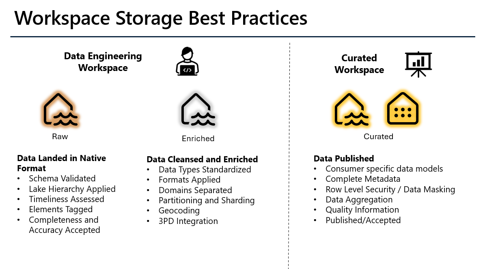

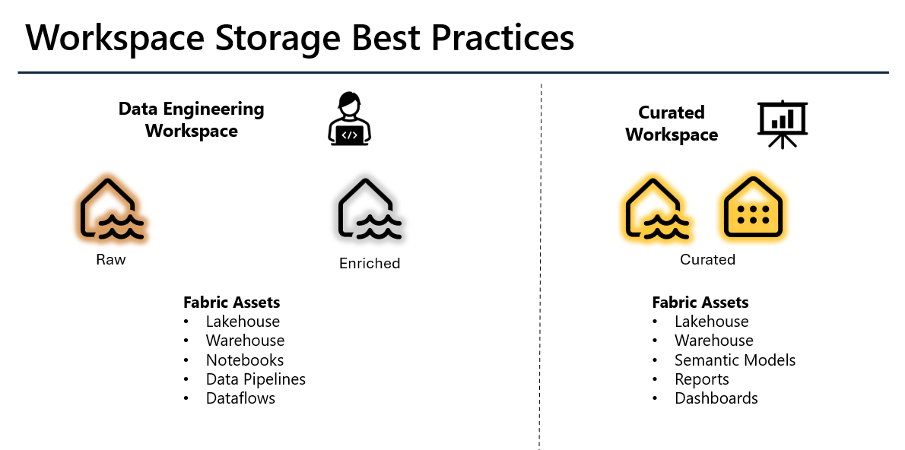

Depending on your scenario, you may need to deviate from this but this is a good place to get started and then adjust as needed.

# Scenario 1 (Lakehouse without Schema enabled)
## Overview
Zach Christoff is a Fabric user who need access to only specific tables that reside the in the Curated Workspace.  We want to create a separate workspace and allow him to access only a few tables.

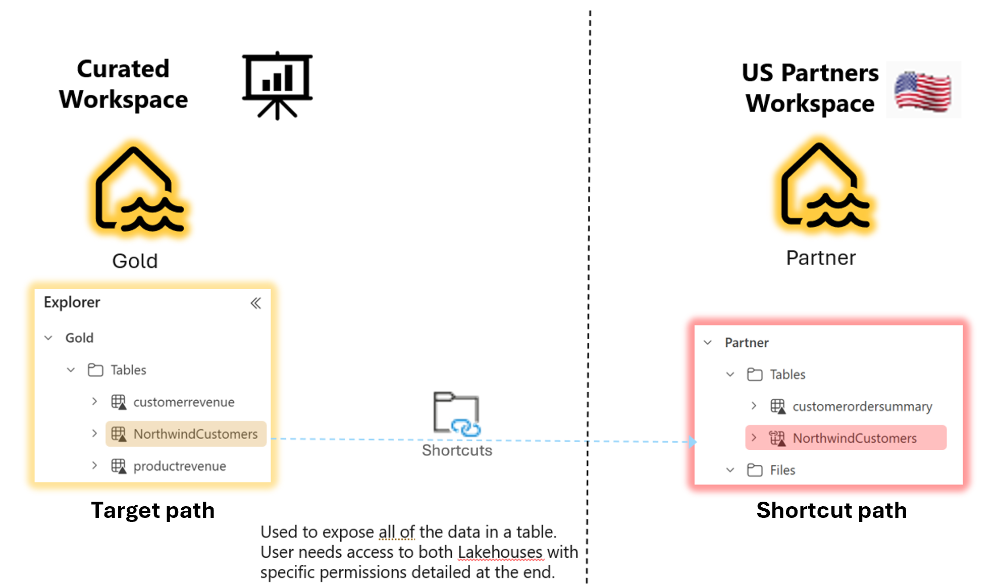

## Users Involved 
<B>Jack Bender</B> – Admin User, is Admin in both workspaces 
<B>Zach Christoff</B> - Business User, no admin rights, only has access the US Partners workspace.

## Glossary
<B>Target path</B>: The location that a shortcut points to. 
<B>Shortcut path</B>: The location where the shortcut appears
This aligns with the nomenclature at [Secure and manage OneLake shortcuts - Microsoft Fabric | Microsoft Learn](https://learn.microsoft.com/en-us/fabric/onelake/onelake-shortcut-security)<

## Steps Overview
1. Zach has <b>no Workspace Access </b>in the Target Path
2. Zach has <b>Read All SQL Endpoint Data</b> on the Lakehouse in the Target Path.  This allows him to query from the SQL Analytics Endpoint.
3. Ensure that Zach does not have the <b>DefaultReader role</b> on the target Lakehouse.  By removing this, Zach cannot read the Lakehouse tables.
4. Create a <b>Custom Role with limited Read access</b> on the Target Lakehouse via <b>Manage OneLake data access</b> and assigned Zach that role.  This allows Zach to only see the tables we want him to see.
5. Zach <b>creates the Shortcut</b> in the Shortcut Path workspace.  
6. <b>DENY SELECT</b> on the restricted Target Lakehouse tables via the SQL Analytics Endpoint so Zach cannot view them via the SQL Analytics Endpoint.   

### Step 1 - User Has No Workspace Access in the Target Path
Zach Christoff has no access to the Curated Workspace.  He is not listed under Manage Access on that Workspace

### Step 2 - Read Access on the Lakehouse in the Target Path

1. In the workspace item listing, find the Gold Lakehouse and click on the <b>ellipses/more options</b> and select <b>Manage Permissions</b> 
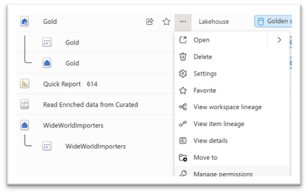

2. Click <b>Add User</b> and select user and give them only <b>Read all SQL endpoint data</b>. 
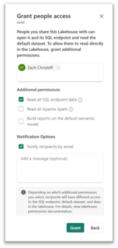

3. The user should show in the listing with Read Permissions. 
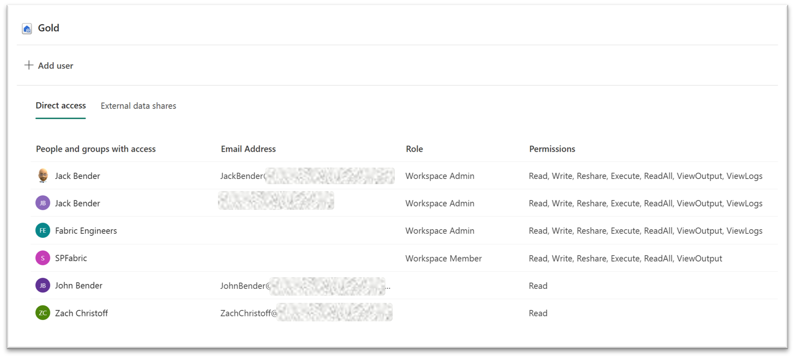

### Step 3 - Ensure the User does not have access to the target Lakehouse

1. In the Gold Lakehouse in the Curated Workspace, go to <b>Manage OneLake data access (preview)</b>.
2. Open the <b>DefaultReader</b> role and click the <b>Assign Role</b> button and ensure that Zach Christoff is not listed under Assigned users. 
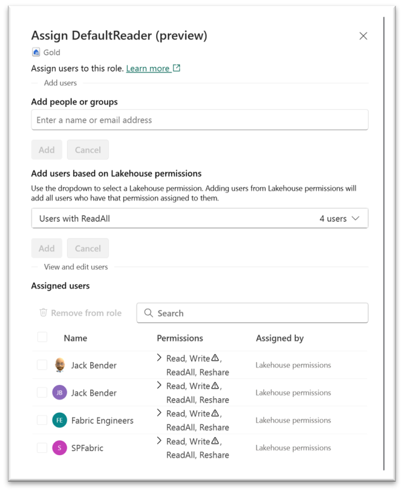

### Step 4 - Assign Custom Role access on the Target Lakehouse

1. In the Gold Lakehouse in the Curated Workspace, go to <b>Manage OneLake data access (preview)</b>.
2. Click <b>+ New role</b> and do the following… 
   a. Role Name – <b>ReadNwdCust</b>  
   b. Under <b>Selected folders</b> choose the <b>NorthwindCustomers</b> table. 
   c. Click Save 
   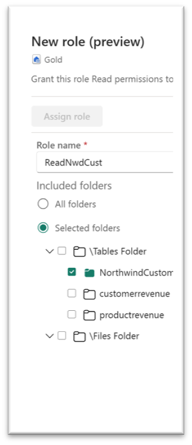
3. Click <b>Assign role</b>.
4. On the assign screen, add the user from <b>Add people or groups</b> not the ~~Add users based on Lakehouse permissions~~.  When finished, it should look like the following... 
   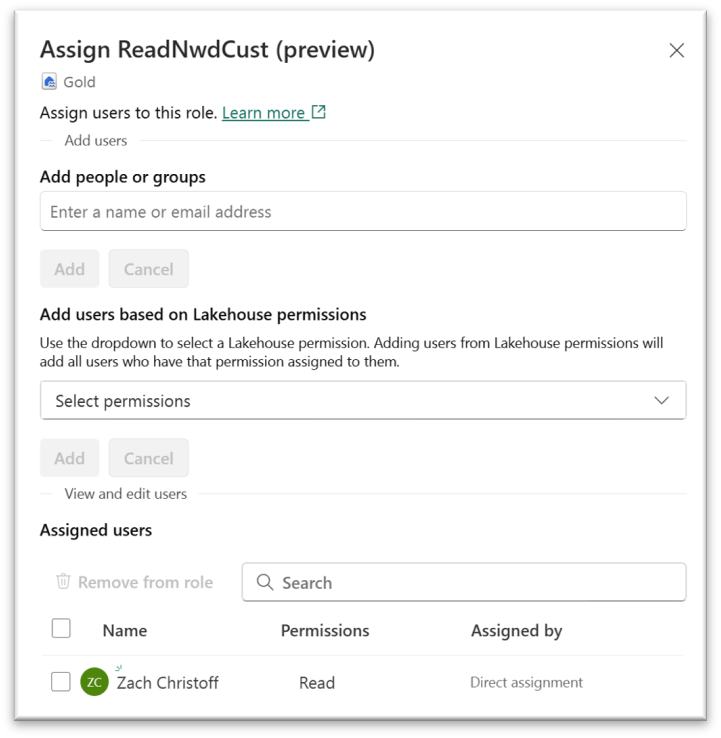
5. Click Save

### Step 5 - Create the Shortcut in the Shortcut Path workspace

1. <b>Prerequisite</b>: Zach Christoff user has Contributor access to the US Partners workspace.  (Shortcut Path)
2. Logged in as Zach Christoff, go to the <b>Partner</b> Lakehouse in the <b>US Partners</b> workspace. (Shortcut Path)
3. Click on the ellipsis/more options of the <b>Tables</b> folder and select <b>New Shortcut</b>. 
    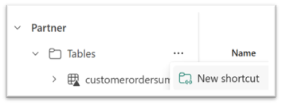
4. In the <b>New Shortcut</b> window, select <b>Microsoft OneLake</b>.
5. Select the <b>Gold Lakehouse</b> in the <b>Curated Sandbox</b> workspace and click Next  (Target Path)
6. Expand tables and Zach should only see <b>NorthwindCustomers</b>, select it and click Next and Create. 
    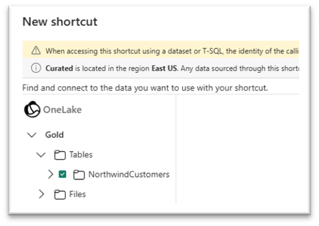

### Step 6 – DENY SELECT on the Lakehouse tables via the SQL Analytics Endpoint on the Target Lakehouse.
By default, users will still see all the tables in the target Lakehouse via the SQL Endpoint.  
1. To restrict their table access, connect to the SQL Analytics Endpoint of the Lakehouse and ran the SQL Deny Statement Below. 
    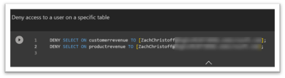
2. After the DENY script is executed, the user only sees the <b>NorthwindCustomers</b> table on the target lakehouse.   
    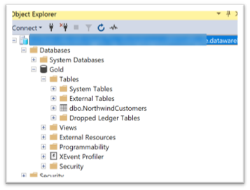

# Scenario 2 (Lakehouse with Schema enabled)
We had another customer ask about applying the steps above to a Lakehouse with Schema enabled in the Target Path.

Thus, for this scenario, we want to only allow access to the Products, Shippers and Suppliers tables.

## Scenario Tested

<b>Target Path</b>
-	Workspace = Schema
-	Lakehouse = Northwind (schema enabled)

    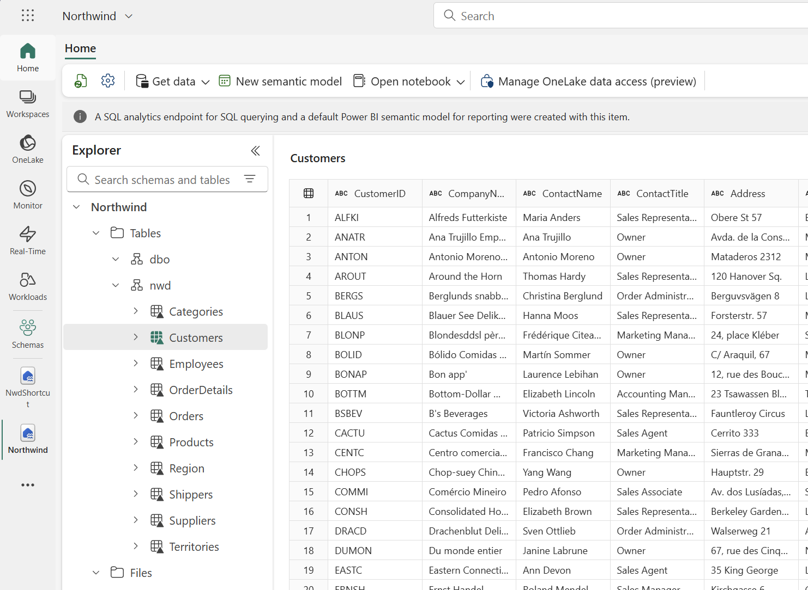

<b>Shortcut Path</b> 
-	Workspace = Shortcut Schema Workspace
-	Lakehouse = NwdShortcut (schema enabled)

    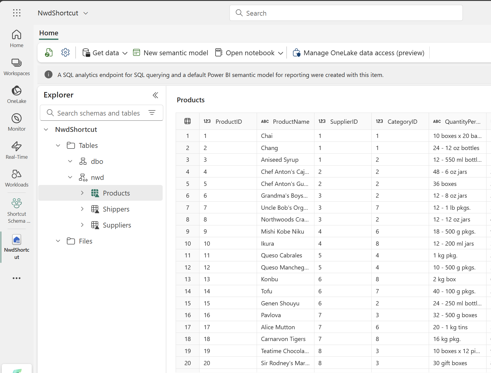

<b> Users Tested With </b>
Jack Bender – Workspace Admin on both workspaces 
John Bender – Native AD user with no workspace access to the Schema and Contributor on the Shortcuts Schema workspace. 
Jack Bender MSFT – B2B user with no workspace access to the Schema and Contributor on the Shortcuts Schema workspace. 

All steps in the previous section were followed.  Below are a couple of items to note for a schema enabled Lakehouse and what I experienced during setup and testing.

For [Step 4](#step-4---assign-custom-role-access-on-the-target-lakehouse), items 3-5, it showed that my Jack Bender MSFT had <B>Permissions = None</b>.  This was a <b>false negative</b>.  Ignore this. &nbsp; 
    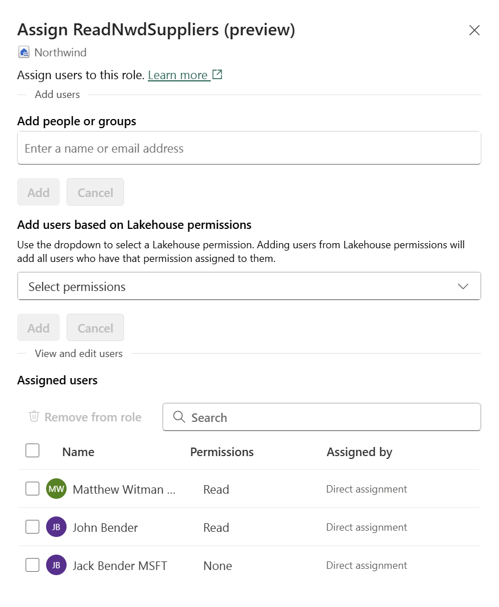

<B>IMPORTANT:</B>  This role only gives them access to the following tables…
 &nbsp; 
    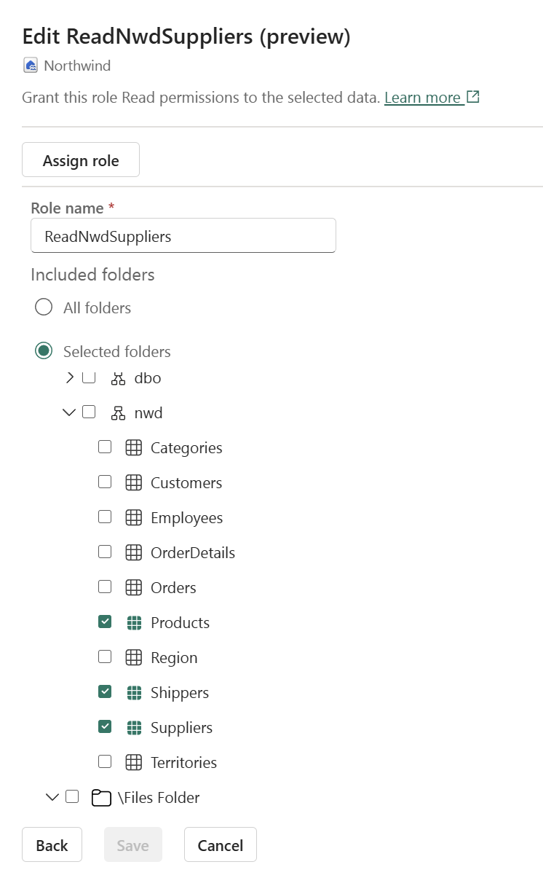

On [Step 5](#step-5---create-the-shortcut-in-the-shortcut-path-workspace), Jack Bender (Admin User) created the shortcut.  Instead of picking individual tables, I shared the entire schema by selecting only the schema folder.  This did not alter security as the users can only see Products, Shippers and Suppliers as seen in the screenshot below as Jack Bender MSFT (B2B Guest User) after the shortcut was created.
 &nbsp; 
    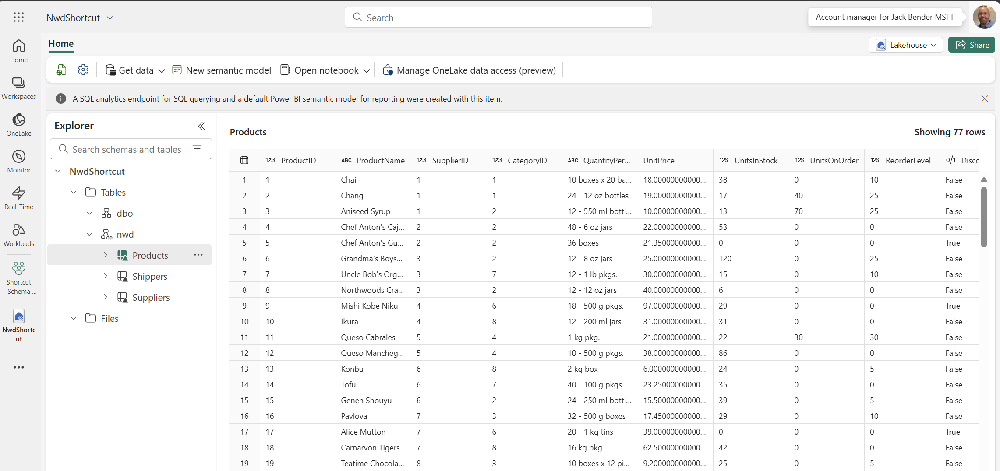

<b>NOTE</b>:  Shortcut icon appears on the schema, not the tables.   Also, do not create the schema ahead of time on the Shortcut Path Lakehouse, this will cause issues, especially if the schemas are the same name.

